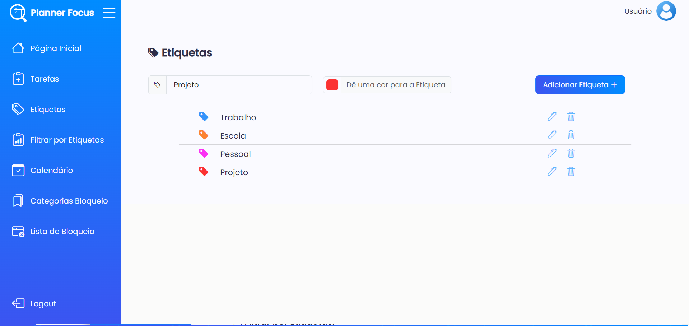
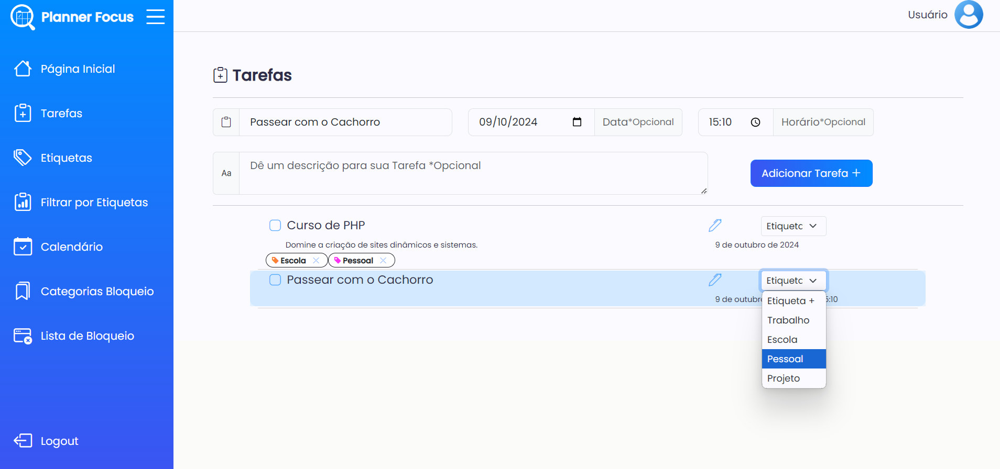
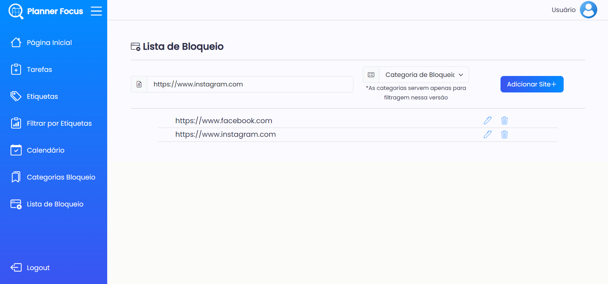
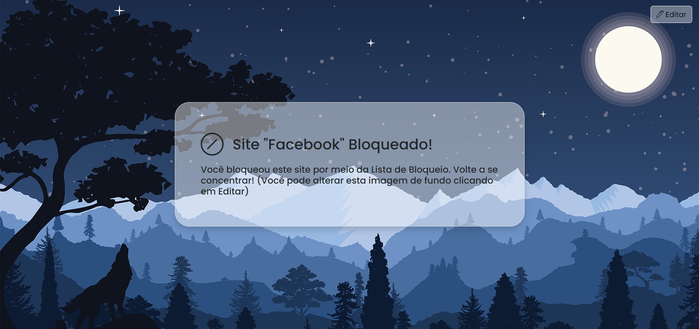

# PlannerFocus 🔍📅

Planner Focus is a web platform accessible through a browser extension, focused on task management and blocking distraction-causing websites.

You can create tasks in a calendar model like Google Calendar or in a ordenaded list, with custom categories.

And block any website you want to avoid distractions in any environment!

The backend is powered by PHP and MySQL, while the frontend leverages JSON, JavaScript, and Bootstrap. The platform follows the MVC architecture and is built as a Single Page Application (SPA) using AJAX for seamless user experience. The infrastructure includes user authentication and session management, real-time task updates, and a responsive design optimized for cross-browser compatibility. The platform's database is designed with scalability in mind, allowing for the addition of new features, such as advanced reporting and analytics, without compromising performance.

This repository has only one commit as it was imported from Gitlab 2023, this was my final TCC for the systems development technician, reaching the highest level in performance and project presentation.
It was made with great care and dedication, being redone three times during its development process to optimize its code and scale.
If you want to try it out for yourself, here is the link!
[plannerfocus.tecnologia.ws] 
